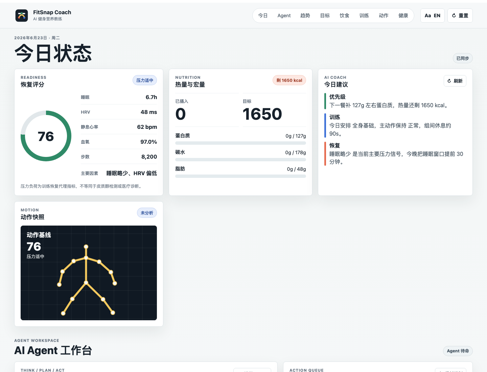

# FitSnap Coach

[](https://fitsnap-coach.vercel.app)
[](#run-locally)
[](#local-data-model)
[](#pose-model-integration)

FitSnap Coach is a bilingual, local-first AI fitness coach MVP that turns goals,
meals, workouts, movement media, and recovery metrics into a daily action plan.
It runs as a static website, stores user data in the browser, and includes a
browser-side agent workspace for nutrition, training, form, and recovery tasks.

[Open the live demo](https://fitsnap-coach.vercel.app) or run it locally in one
command.



## Why Star This Repo

- **Complete AI fitness product loop:** goal setup, calorie and macro targets,
  meal logging, training plans, form checks, recovery scoring, trend charts, and
  an agent action queue.
- **Local-first privacy model:** IndexedDB is the primary database, with
  LocalStorage fallback. User media and health data are not uploaded to a server.
- **Real pose pipeline path:** TensorFlow.js and MoveNet SinglePose Lightning can
  run in the browser for keypoint detection, with a rule-based fallback when the
  model or network is unavailable.
- **Deploys like a static app:** no backend, no build step, no API key required
  for the MVP.
- **Useful reference architecture:** a compact vanilla JavaScript example for
  AI product prototyping, health-tech UX, and browser-only persistence.

## Run Locally

Open `index.html` directly in a browser. If the browser restricts IndexedDB on
`file://`, run this from the project directory:

```bash
python3 -m http.server 4173
```

Then open:

```text
http://127.0.0.1:4173/index.html
```

## Feature Map

| Area | What is included |
| --- | --- |
| Goals | Body metrics, target weight, activity level, training experience, equipment, injuries |
| Nutrition | Calorie and macro targets, photo or text meal logging, editable estimates |
| Training | 7-day plan generation, workout completion tracking, recovery-aware advice |
| Form analysis | Photo/video upload, MoveNet keypoints when available, rule-based scoring fallback |
| Live motion | Camera preview, skeleton overlay, refreshed form feedback |
| Recovery | Simulated Apple Health authorization, JSON/CSV import, sleep, HRV, RHR, SpO2, steps, load |
| Agent | Local observe/reason/act loop, task queue, section deep links, persisted messages |
| Trends | Weekly and monthly charts for calories, protein, workouts, readiness, form, uploads |

## Pose Model Integration

The form analysis pipeline uses a hybrid approach:

```text
uploaded photo/video
-> TensorFlow.js + MoveNet SinglePose Lightning
-> body keypoints
-> angle, symmetry, torso-lean, knee/ankle tracking signals
-> rule-based form scoring
-> coach-readable feedback
```

The model is loaded dynamically from jsDelivr only when the user clicks
**Load pose model** or runs a form analysis. If TensorFlow.js, the pose model, or
reliable keypoints are unavailable, the app falls back to local rule-based
analysis so the product remains usable offline.

Live camera mode uses `navigator.mediaDevices.getUserMedia` and MoveNet in the
browser. It renders a skeleton overlay and live feedback, but it does not save
every frame to history. To persist a form-analysis record, upload a photo/video
and run **Generate form feedback**.

## AI Coach Agent

The agent workspace uses a local rule-based loop:

```text
observe local profile, meals, training, form, health, and trend data
-> reason about the highest-impact constraint
-> generate nutrition, training, recovery, or form tasks
-> let the user open the relevant section or mark the task done
-> persist the messages and tasks in IndexedDB
```

This gives the product an agent-like workflow without requiring a backend or API
key. A production build can replace the local reasoning layer with an LLM call
while keeping the same context builder, task schema, and safety boundaries.

## Local Data Model

The IndexedDB database is named `fitsnap-coach-db`.

Object stores:

- `meta`
- `profile`
- `nutritionTargets`
- `meals`
- `workoutPlan`
- `workoutCompletions`
- `formAnalyses`
- `healthSnapshots`
- `mediaAssets`
- `agentTasks`
- `agentMessages`

## Deployment

Production URL:

```text
https://fitsnap-coach.vercel.app
```

### Vercel

1. Push this folder to a GitHub repository.
2. Import the repository in Vercel.
3. Use the default static-site settings. No build command is required.
4. Vercel will serve `index.html` over HTTPS.

The included `vercel.json` sets browser security headers and allows camera
access from the same origin for live form checks.

### Netlify

1. Push this folder to a GitHub repository or drag the folder into Netlify
   Deploys.
2. Netlify should publish the project root.
3. No build command is required.

The included `netlify.toml` publishes the static root and sets matching security
headers.

## Roadmap

- Add a real social preview image to the GitHub repository settings.
- Add a license before asking external contributors to reuse or fork the code.
- Add hosted LLM calls for the agent while preserving local privacy boundaries.
- Add optional auth, cloud sync, and media storage for cross-device continuity.
- Add automated smoke tests for local persistence, language switching, and core
  agent flows.

## Growth Notes

See [docs/star-growth-playbook.md](docs/star-growth-playbook.md) for GitHub
metadata, launch checklist, and ready-to-post English and Chinese copy.

## Health Boundary

FitSnap Coach does not provide medical diagnosis and does not directly measure
cortisol. The recovery score uses proxy signals from health and training data to
estimate stress load trends. If heart rate, blood oxygen, sleep, or physical
symptoms remain abnormal, users should consult a qualified professional.
